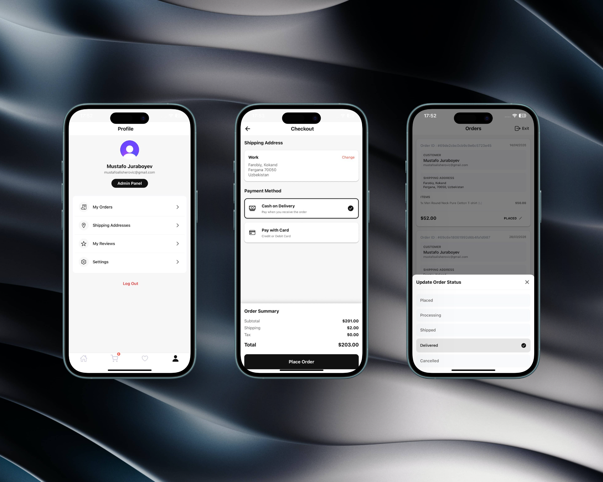
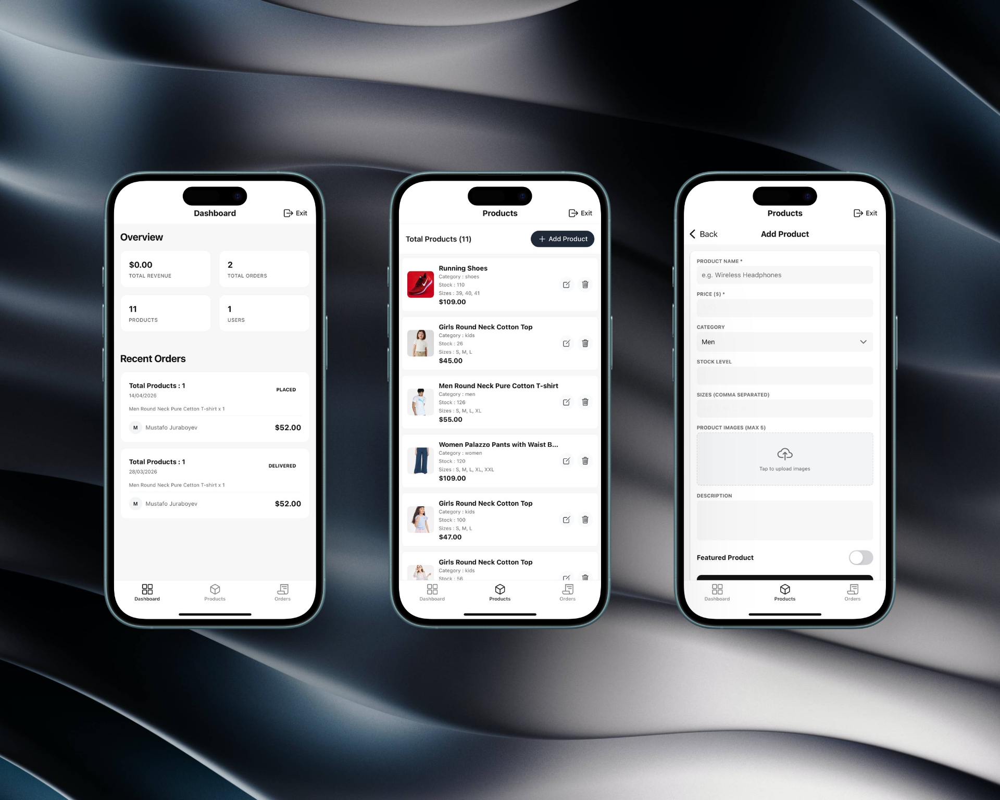

# Ecommerce Native App

A fully functional E-commerce mobile application built with Expo and React Native.

## Features

- Authentication with Clerk
- Shopping cart functionality
- Product management system
- Admin dashboard
- Shipping address management
- Responsive mobile UI
- Image upload support with ImageKit

## Screenshots

<p align="center">
  
  
  
</p>

## Live Demo

[Live Preview](https://e-commerce.mustafoalisherovich.ru)

## Tech Stack

### Client

- Expo
- React Native
- NativeWind
- Clerk

### Server

- Node.js
- Express.js
- MongoDB
- ImageKit

## Installation

Clone the repository:

```bash
git clone https://github.com/MustafoAlisherovich/Ecommerce_native_app.git
```
